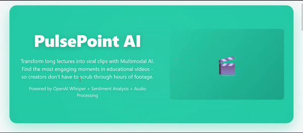

# PulsePoint AI

Transform long educational videos into short viral clips using multimodal AI.

Built for ByteSize Sage AI Hackathon 2026

## Overview

PulsePoint AI helps content creators extract the most engaging moments from lengthy educational content. It analyzes both what's being said (through transcription and sentiment analysis) and how it's being said (through audio signal processing) to identify the best clips for social media.

The typical workflow: upload an hour-long lecture or podcast, and get back 3-5 short clips that capture the most emotionally impactful moments - ready to share on TikTok, Instagram Reels, or YouTube Shorts.

## Demo Video

See PulsePoint AI in action:



*[Watch full demo →](https://github.com/user-attachments/assets/7d8e00e2-1622-4c81-8e76-2e748e59234e) (1m 17s, HD)*

## Key Features

- Multimodal analysis combining audio features with text sentiment
- OpenAI Whisper for accurate speech-to-text transcription
- Automatic emotional peak detection using DistilBERT
- Generates 3-5 optimized video clips per upload
- Includes confidence scores and keyword extraction
- Bulk download as ZIP archive
- Auto-generated thumbnails for each clip

## Quick Start

### Prerequisites

- Python 3.8+
- FFmpeg ([Download here](https://ffmpeg.org/download.html))

### Installation

```bash
# 1. Clone repository
git clone https://github.com/rogerdemello/roger-bytesize-sage-ai-hackathon.git
cd ByteSageAI

# 2. Create virtual environment
python -m venv venv
source venv/bin/activate  # On Windows: venv\Scripts\activate

# 3. Install dependencies
pip install -r requirements.txt

# 4. Start the server
python main.py
```

Open **http://localhost:8000** in your browser.

## How to Use

1. Start the server and navigate to http://localhost:8000
2. Upload your video file (or paste a Google Drive link)
3. Adjust settings if needed: number of clips, duration, minimum gap between clips
4. Click "Generate Viral Reels" and wait for processing
5. Download individual clips or get everything as a ZIP

## Architecture

The system works in three phases:

**Transcription**: Uses OpenAI Whisper to convert speech to text with precise timestamps. This tells us what's being said.

**Analysis**: Runs two parallel processes - DistilBERT for sentiment analysis of the transcript (detecting emotional content, emphasis, keywords), and Librosa for audio feature extraction (RMS energy, spectral characteristics, onset detection).

**Fusion**: Combines both signals into a single emotional score:
```
Score = 0.4 × Sentiment + 0.3 × Energy + 0.15 × Rhythm + 0.15 × Tone
```

The highest-scoring segments become your output clips. This multimodal approach catches both explicit emotional content (excited language) and implicit cues (voice energy, pacing changes).

## Tech Stack

- AI/ML: OpenAI Whisper, Transformers (Hugging Face), Librosa, PyTorch
- Video: MoviePy, Pillow, FFmpeg
- Backend: FastAPI, Uvicorn
- Frontend: Pico.css, Vanilla JavaScript
- Processing: NumPy, SciPy

## Project Structure

```
ByteSageAI/
├── main.py              # FastAPI backend server
├── video_processor.py   # Multimodal AI processing engine
├── static/
│   ├── index.html      # Pico.css frontend
│   └── app.js          # Client-side logic
├── requirements.txt     # Python dependencies
└── README.md           # This file
```

## 🎯 Hackathon Alignment

## Output Format

Each processing job produces:
- 3-5 MP4 video clips (configurable duration, 60s default)
- Thumbnail images (JPG, 320×180)
- Metadata JSON with timestamps, confidence scores, and extracted keywords
- ZIP archive containing everything

## Future Ideas

- Face tracking for intelligent vertical crop
- Auto-generated karaoke-style captions
- Batch processing for multiple videos
- Custom watermarks and branding

## License

MIT License - created for ByteSize Sage AI Hackathon 2026
